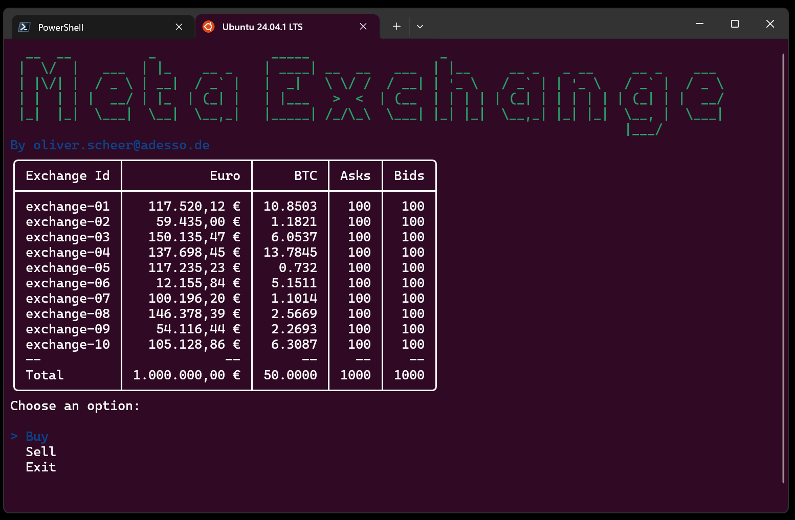
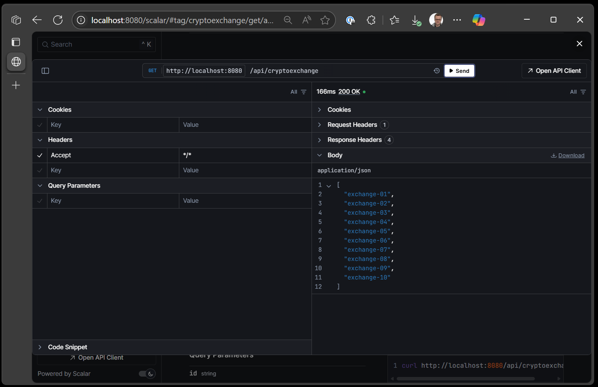

# Meta Exchange

This is a sample project, to demonstrate some skills.

The task is defined in this [description](docs/task.md).

## Clone Repository

I'm using GitHub Cli, Docker on Linux and Ubuntu 24.04

```bash
gh auth login
gh repo clone oliverscheer/meta-exchange
```

## Run Console App

```bash
cd meta-exchange

# Build Container
docker build -t metaexchangeconsole:latest ./src -f ./src/MetaExchange.Console/Dockerfile

# Run interactive
docker run -it metaexchangeconsole
```



## Run Web API

```bash
cd meta-exchange

# Build Container
docker build -t metaexchangewebapi:latest ./src -f ./src/MetaExchange.WebApi/Dockerfile

# Run interactive
docker run -p 8080:8080 -p 8081:8081 --rm metaexchangewebapi
docker run -d -p 8080:8080 -p 8081:8081 --name metaexchangewebapi metaexchangewebapi

```

Then open a browser on this address: <http://localhost:8080/scalar/>



## Remarks

- No Database used for simplicity and time constraint. All data is kept in memory. Restart = Reset.
- Data is read from embedded json files with the [EmbeddedResourceHelper](src/MetaExchange.Shared/Helper/EmbeddedResourceHelper.cs)
- DebuggerDisplay Attribute is used for better debugging experiences. [Example Usage](src/MetaExchange.Shared/Models/Order.cs).
- [.editorconfig](src/.editorconfig) used to get solution wide coding rules applied.

## Contact

Feel free to reach out via issue or email.
