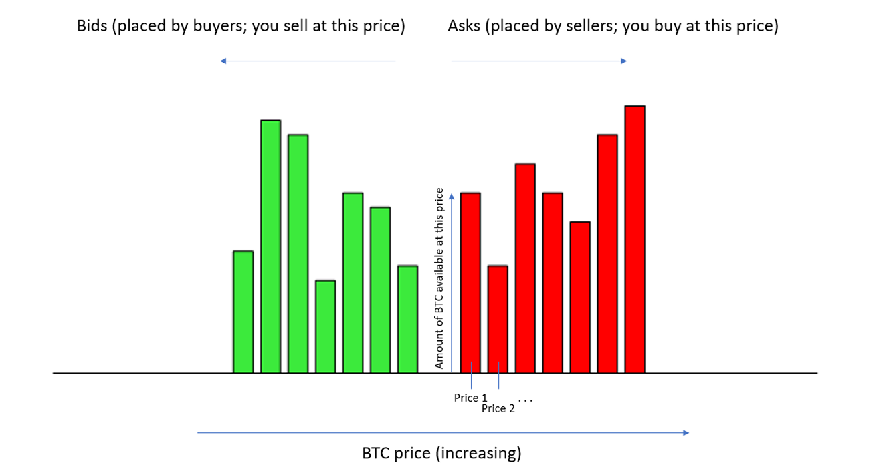
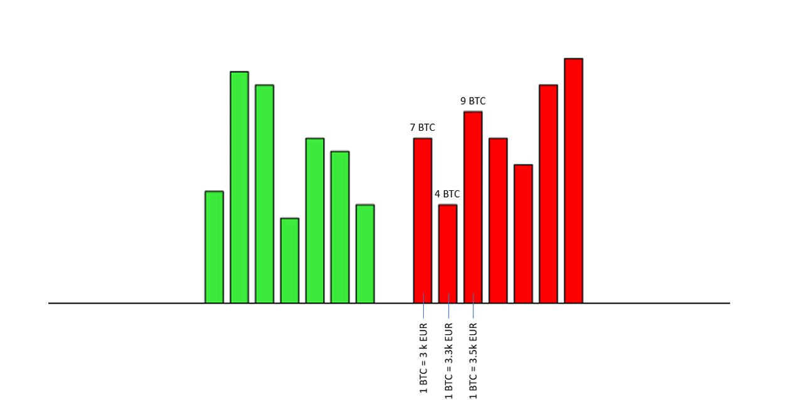

# BACKGROUND KNOWLEDGE

To understand the task, educate yourself about the order book (basic knowledge is more than enough).

For simplicity, let's assume that we are dealing with a cryptoexchange that only offers Bitcoin (BTC) and you can sell or buy it only for EUR.

At any given time, an order book is the bid-ask state of this cryptoexchange.

In other words, an order book is a bunch of "bids" and "asks".

In our example, a bid is the price at which the buyer is willing to buy a certain amount of BTC.

An ask is the price at which the seller is willing to sell a certain amount of BTC.

When a bid and an ask are matched, a trade is made, but this is not relevant for solving this task.

Take a look at Figure 2:

How much EUR do you need to buy 9 BTC at the lowest possible price? The answer is 7 x 3k EUR + 2 x 3.3k EUR = 27,600 EUR.

## The Task

### Part 1

Your task is to implement a meta-exchange that always gives the user the best possible price if he is buying or selling a certain amount of BTC.

Technically, you will be given n order books [from n different cryptoexchanges], the type of order (buy or sell), and the amount of BTC that our user wants to buy or sell.

Your algorithm needs to output one or more buy or sell orders.

In effect, our user buys the specified amount of BTC for the lowest possible price or sells the specified amount of BTC for the highest possible price.

To make life a bit more complicated, each cryptoexchange has EUR and BTC balance.
Your algorithm needs to achieve the best price within these constraints.

The algorithm cannot transfer any money or crypto between cryptoexchanges, that means you can only sell what you have ‘stored’ on that cryptoexchange account (EUR or BTC).

Together with this task, you will receive a bunch of JSON files with order books you can use to test your solution.

In each file, you will also find the given limit (EUR/BTC) of this cryptoexchange.

Your solution should be a relatively simple .NET Core console-mode application, which reads the order books with limits, order amounts and order type, and outputs a set of orders to execute against the given order books (exchanges).

### Part 2

Implement a Web service (Kestrel, .NET Core API), and expose the implemented functionality through it.

Implement an endpoint that will receive the required parameters (order amount, order type) and return a JSON response with the "best execution" plan.

### BONUS TASKS

- Write some tests, on relatively simple input data (e.g., order books with only a few bids and asks), to test your solution on typical and edge cases.
- Deploy your Web service locally with Docker.

## OTHER NOTES

Please use GIT while developing the code.

Keep it as simple as the nature of this problem allows it.

Do not over-engineer.

Be ready to explain / demonstrate your solution.

May the force be with you.
